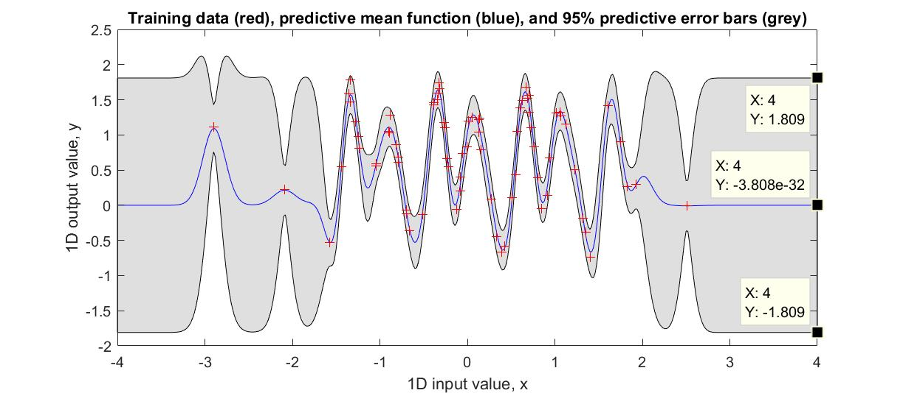
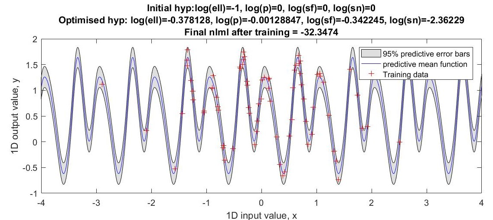
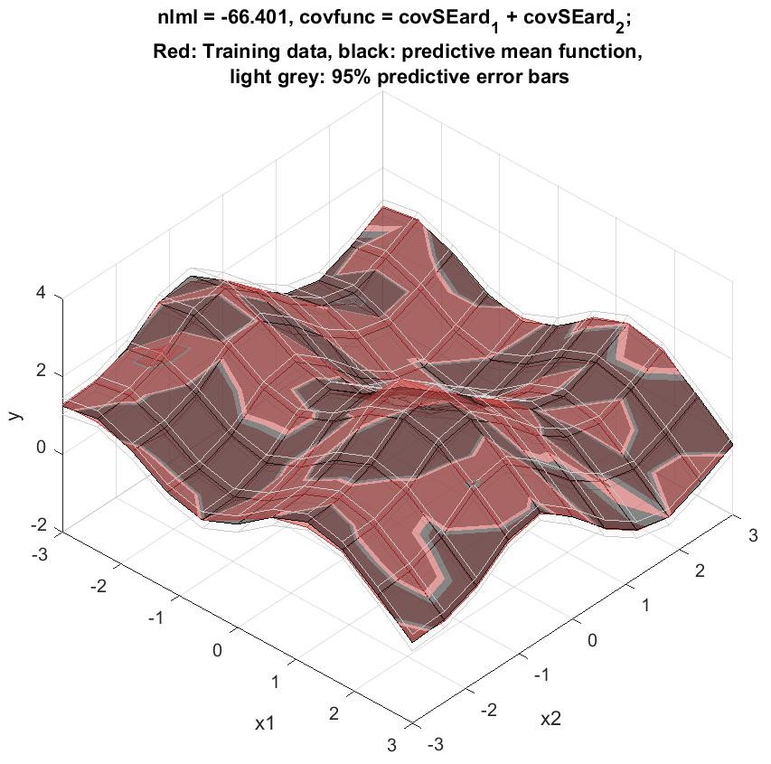
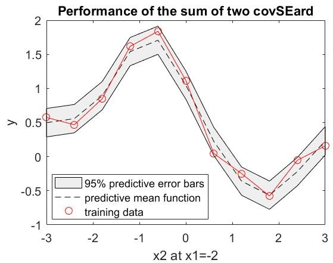

# Regression using different Gaussian Processes (GP)

Given a dataset of 1D continuous-valued input-output pairs `cw1a.mat`, Gaussian Process models with **different covariance functions** were individually fit to the data and their performance compared with respect to **marginal likelihood**. For each model, its hyper-parameters had been chosen to maximise the marginal likelihood, so as to avoid overfitting.

Below show the data fits for ***isotopic squared exponential*** and ***periodic*** covariance functions respectively:

  

  

Gaussian Process had also been used to perform regression on a 2D-input 1D-output dataset `cw1e.mat`. The best result is demonstrated below, where the red surface maps the observed data; black surface gives the prediction:

  
  

